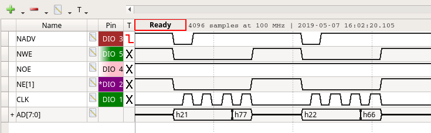

# psram-intf

At some point in the near future, I'd like to begin interfacing to my various STM32 devkits with an FPGA. As a first try, the FSMC is probably the best way to approach this based upon the projects I have lined up. This project simply exposes internal block memory over a generic 8-bit multiplexed sychronous interface. Aligned/unaligned 32b/16b/8b rd/wr's are supported flawlessly and only 12 lines are required.

Implemented on a Lattice MachX03 Starter Kit. Tops out at ~150MHz.

